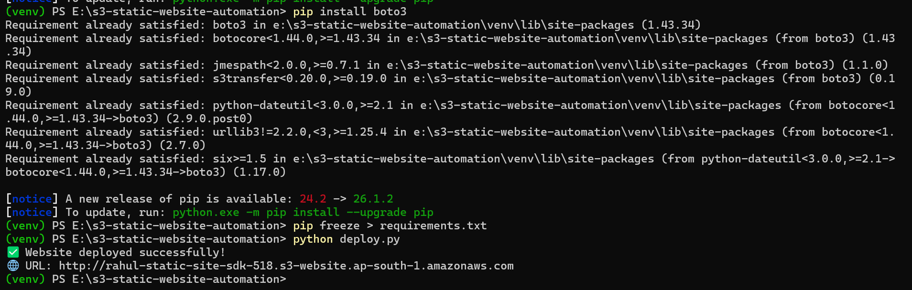
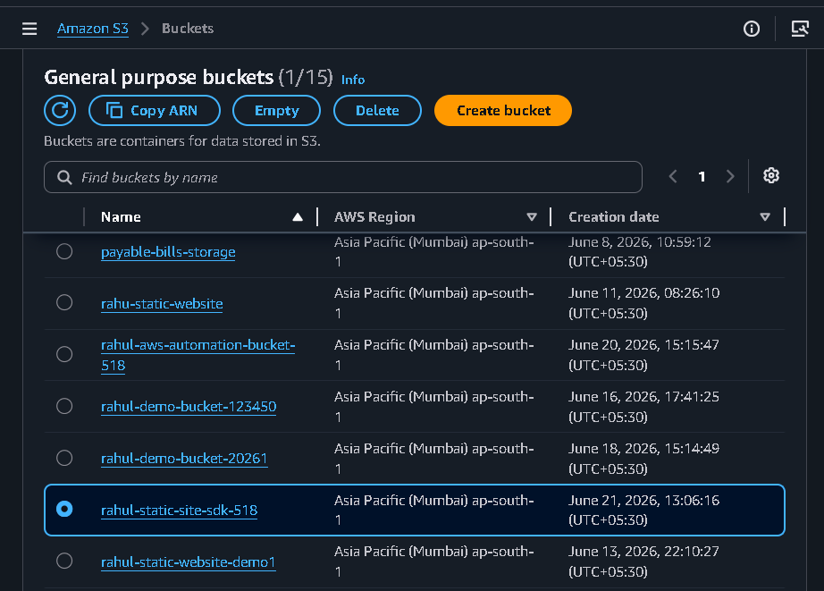
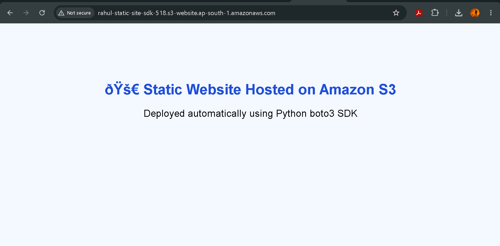

# 🚀 AWS S3 Static Website Hosting Automation using Python boto3

## 📌 Project Overview

This project automates the deployment of a static website to Amazon S3 using Python and the AWS SDK (boto3).

Instead of manually creating buckets and uploading files through the AWS Console, the entire deployment process is automated through a Python script.

---

## 🎯 Objective

* Create an S3 bucket using Python
* Configure static website hosting
* Apply public access permissions
* Upload website files automatically
* Generate a public website URL

---

## 🛠️ Technologies Used

* Python 3
* boto3 (AWS SDK for Python)
* Amazon S3
* AWS IAM
* Git & GitHub

---

## 📂 Project Structure

```text
s3-static-website-automation/
│
├── website/
│   ├── index.html
│   ├── style.css
│   └── error.html
│
├── deploy.py
├── requirements.txt
└── README.md
```

---

## 🔄 Architecture Flow

```text
Website Files
      │
      ▼
Python boto3 Script
      │
      ▼
Amazon S3 Bucket
      │
      ▼
Static Website Hosting
      │
      ▼
Public Website URL
```

---

## ⚙️ Setup Instructions

### 1. Clone Repository

```bash
git clone https://github.com/Rahulsada-518/s3-static-website-automation.git
cd s3-static-website-automation
```

### 2. Create Virtual Environment

```bash
python -m venv venv
```

### 3. Activate Virtual Environment

Windows:

```bash
venv\Scripts\activate
```

Linux/Mac:

```bash
source venv/bin/activate
```

### 4. Install Dependencies

```bash
pip install -r requirements.txt
```

### 5. Configure AWS Credentials

```bash
aws configure
```

Provide:

```text
AWS Access Key ID
AWS Secret Access Key
Region: ap-south-1
Output Format: json
```

### 6. Run Deployment Script

```bash
python deploy.py
```

---

## 📸 Project Screenshots

### VS Code Project Structure


### Terminal Output



### S3 Bucket Created



### Static Website Hosting Enabled


### Website Files Uploaded


### Final Website Output


---

## ✅ Features

* Automated S3 Bucket Creation
* Static Website Hosting Configuration
* Bucket Policy Automation
* Website File Upload Automation
* Public Website URL Generation
* Cloud Deployment using AWS SDK

---

## 📚 Learning Outcomes

Through this project I learned:

* AWS S3 Static Website Hosting
* AWS IAM Permissions
* Python boto3 SDK
* Infrastructure Automation
* Cloud Deployment Best Practices
* GitHub Project Documentation
